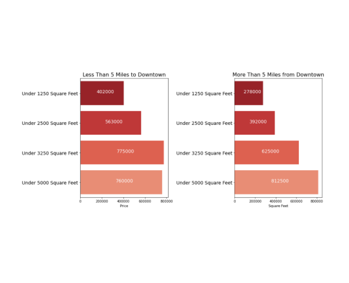

# Housing_Data_Analysis

## Authors:
1. Justin Weible
2. Naomi Weinberger 

## Project Goals:
 1. Analyze the housing market in King County
 2. Identify the key factors in predicting the price of a house
 3. Advise potential home owners in how to get most for their money. 

## [Data Source]: https://www.kaggle.com/harlfoxem/housesalesprediction

## Analysis:
Location, the year that the house was built, number of bedrooms, number of bathrooms, square footage, grade, whether or not it is a waterfront property and whether or not it was renovated all proved to be key components to determining the price of the house.

### Proximity to Downtown 
Each mile out of the city reduces the price of the house by approximately $10,400.

### Year Built
The age of the house decreases the value by approximately $1,172 per year. 

### Number of Bedrooms
Each bedroom adds an approximate value of $15,580

### Number of Bathrooms
Each Bathroom adds an approximate value of $15,660

### Square Footage
Each squarefoot adds an approximate value of $115.84

## Conclusions:
The closer the house a house is to downtown, the more expensive it'll be. Within the two categories of within 5 miles of downtown and more than 5 mile sfrom downtown, it is clear the affect that squarefootage, bedrooms, bathrooms, and year built have  on the price. (See images and analysis above.)

## For More Information:
See the full analysis in the [Jupyter Notebook]:https://github.com/Naomiweinberger/Housing_Data_Analysis  or review this [presentation.]: https://docs.google.com/presentation/d/1dU02tkWPJVnZrphxWwIIc8Nw2bcwtLiyPhQUq-QWykQ/edit#slide=id.ge2b403e7c5_2_40

